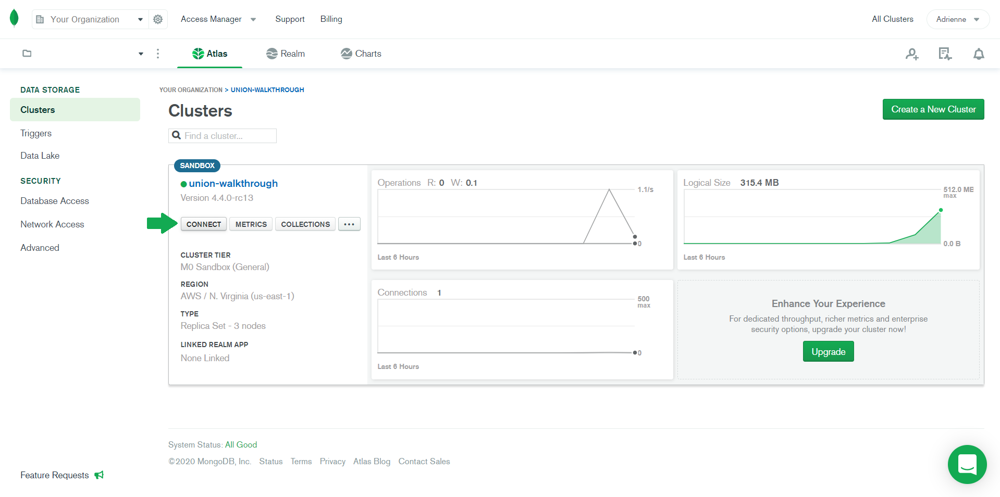
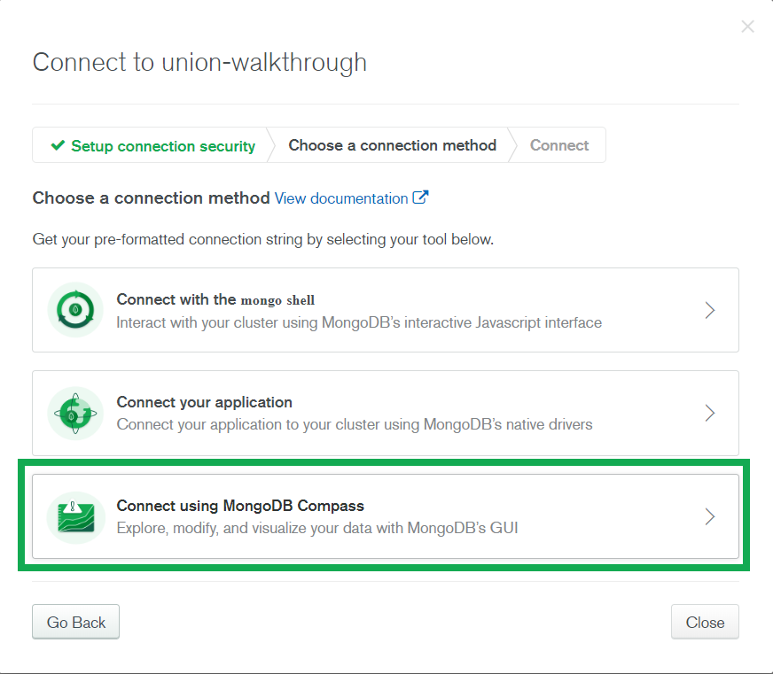
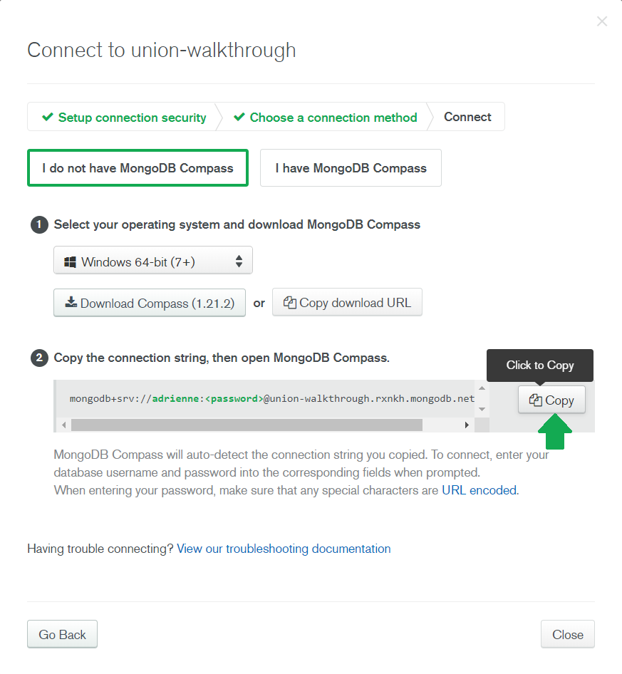
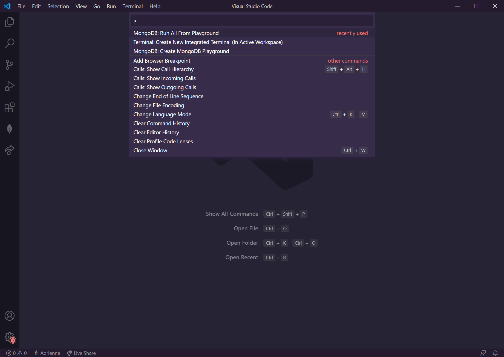
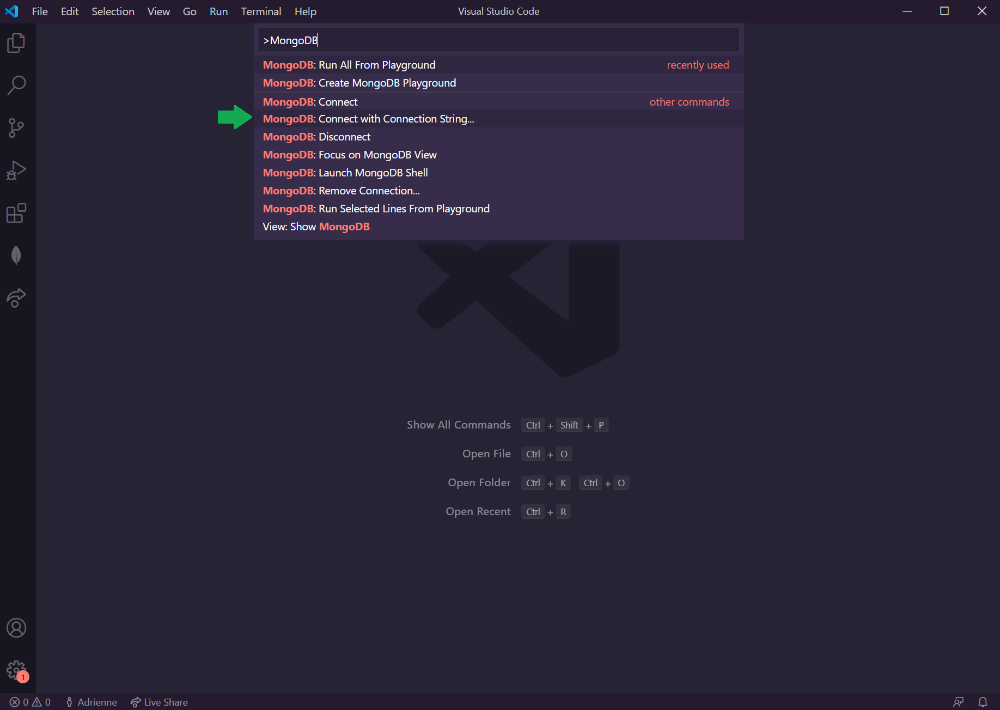
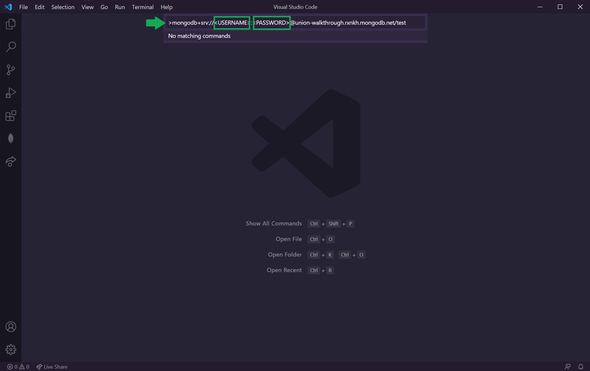

# UNION ALL Walkthrough Examples
Hello! If you're looking for code samples that demonstrate how to use the `$unionWith` operator, you're in the right place!

## MongoDB Playgrounds

- [Using `$unionWith`](/unionWith_examples_similar_schemas.mongodb)
- [`$unionWith` and Different Schemas](/unionWith_examples_different_schemas.mongodb)

I've created these MongoDB Playgrounds to work in conjunction with this tutorial. For additional context and a more thorough walkthrough on how to use the `$unionWith` pipeline stage, be sure to read How to Use the Union All Aggregation Pipline Stage in MongoDB 4.4 as you work through the examples!

## Setup
So you're ready to try the new `$unionWith` stage? Let's get you setup first! 😉

Choose your scenario: 

### **I don't have an Atlas cluster set up yet**:
1. You'll need an Atlas account to play around with MongoDB Atlas! [Create one](https://docs.atlas.mongodb.com/tutorial/create-atlas-account/) if you haven't already done so. Otherwise, log into your Atlas account.
1. [Setup a free Atlas cluster](https://docs.atlas.mongodb.com/tutorial/deploy-free-tier-cluster/) (no credit card needed!). Be sure to select **MongoDB 4.4** (may be Beta, which is OK) as your version in Additional Settings!

> **If you don't see the prompt to create a cluster**: You may be prompted to create a project first before you see the screen to create your first cluster. In this case, go ahead and create a project first (leaving all the default settings). Then continue with the instructions to deploy your first free cluster!

3. Once your cluster is set up, [add your IP address](https://docs.atlas.mongodb.com/tutorial/whitelist-connection-ip-address/) to your cluster's connection settings. This tells your cluster who's allowed to connect to it.
1. Finally, [create a database user](https://docs.atlas.mongodb.com/tutorial/create-mongodb-user-for-cluster/) for your cluster. Atlas requires anyone or anything accessing its clusters to authenticate as MongoDB database users for security purposes! Keep these credentials handy as you'll need them later on.
1. Continue with the steps in [Connecting to your cluster](#Connecting-to-your-cluster).

### **I have an Atlas cluster set up**:
Great! You can skip ahead to [Connecting to your cluster](#Connecting-to-your-cluster)

### Connecting to your cluster
To connect to your cluster, we'll use the MongoDB for Visual Studio Code extension (VS Code for short 😊). You can view your data directly, interact with your collections, and much more with this helpful extension! Using this also consolidates your workspace into a single window, removing the need to jump back and forth between your code and MongoDB Atlas! 

1. Install the [MongoDB for VS Code](https://marketplace.visualstudio.com/items?itemName=mongodb.mongodb-vscode) extension (or install [VS Code](https://code.visualstudio.com/Download) first, if you don't already have it 😉).
1. To connect to your cluster, you'll need a connection string. You can get this connection string from your cluster connection settings.  Go to your cluster and select the "Connect" option:

1. Select the "Connect using MongoDB Compass" option. This will give us a connection string in the [DNS Seedlist Connection format](https://docs.mongodb.com/manual/reference/connection-string/#dns-seedlist-connection-format) that we can use with the MongoDB extension.

> The MongoDB for VS Code extenstion also supports the [standard connection string format](https://docs.mongodb.com/manual/reference/connection-string/#standard-connection-string-format). Using the DNS seedlist connection format is purely preference.

4. Skip to the second step and copy the connection string (don't worry about the other settings, you won't need them):

1. Switch back to VS Code. Press `Ctrl` + `Shift` + `P` (on Windows) or `Shift` + `Command` + `P` (on Mac) to bring up the command palette. This shows a list of all VS Code commands.

1. Start typing "MongoDB" until you see the MongoDB extension's list of available commands. Select the "MongoDB: Connect with Connection String..." option.

1. Paste in your copied connection string. Don't forget! You have to replace the placeholder password with your actual password! Double check that the pasted username is also your username as well.

1. Press enter to connect! You'll know the connection was successful if you see a confirmation message on the bottom right. You'll also see your cluster listed when you expand the MongoDB extension pane.

With the MongoDB extension installed and your cluster connected, you can now use MongoDB Playgrounds to test out the UNION ALL examples!

# Issues

If you run into any issues using these Playgrounds, please don't hesitate to open an issue against this repo. I'll try my best to answer them!

# Contributions

If you have a sample aggregation that uses the `$unionWith` stage that you don't mind sharing, feel free to submit a PR! Have some sample data and a working aggregation ready to go in a MongoDB Playground file, and I'll be happy to add it to this repo :)

# About Adrienne

I'm a senior developer advocate at MongoDB! You can find me here:

[Website](https://www.adrienne.io/)
[Twitter](https://twitter.com/AdrienneTacke)
[Twitch](https://www.twitch.tv/yo__adrienne)
[Instagram](https://www.instagram.com/adriennetacke/)

And you'll occasionally see me here too:
[Official MongoDB Twitch Channel](https://www.twitch.tv/mongodb)